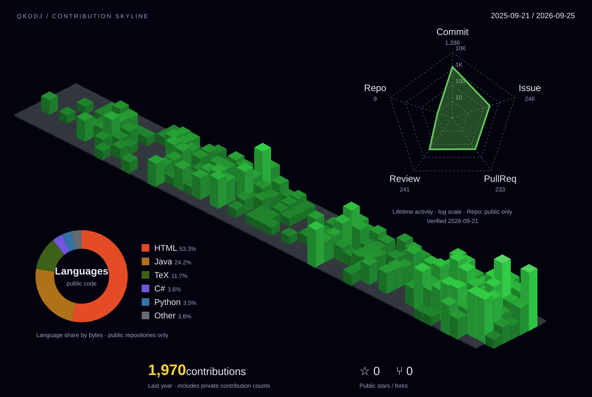

  

  코드를 쌓고, 리뷰하고, 더 나은 방향으로.

통계 집계 기준

- **Contributions / 잔디:** GitHub 기여 캘린더의 최근 1년 기록입니다. 공개 설정된 비공개 기여 수를 포함합니다.
- **Commits / PRs / Issues:** 로그인된 계정으로 접근 가능한 저장소에서 검색된 누적 작성 건수입니다. 커밋은 GitHub 검색에 색인된 범위이며 기여 캘린더의 커밋 집계와 다를 수 있습니다.
- **Code review:** 리뷰를 남긴 PR의 누적 개수입니다. 본인이 작성한 PR은 제외하며, 한 PR에 여러 번 리뷰해도 1건입니다.
- **3D 잔디:** 하루 기여 수가 많을수록 블록이 높고 밝아집니다. 높이는 제곱근 비례로 표현합니다.
- **레이더:** 누적 활동을 로그 눈금(10·100·1K·10K)으로 비교합니다. Repo는 본인 소유의 공개 저장소 수이며 포크 저장소는 제외합니다.
- **Languages / Stars / Forks:** 본인 소유의 공개 저장소(포크 제외) 기준입니다. 언어 비율은 코드 바이트 수이며 비공개 업무의 기술 비중을 뜻하지 않습니다.
- 캘린더와 누적 활동의 기간·집계 방식은 다르므로 각 카드의 합계가 Contributions와 일치하지 않습니다.
- 캘린더는 매일 자동 갱신됩니다. 누적 활동은 카드의 **Verified** 날짜 기준이며, 비공개 활동에 접근 가능한 갱신용 인증이 설정된 경우 함께 갱신됩니다.
- 비공개 저장소의 이름, 코드, 이슈 및 리뷰 내용은 표시하지 않습니다.

